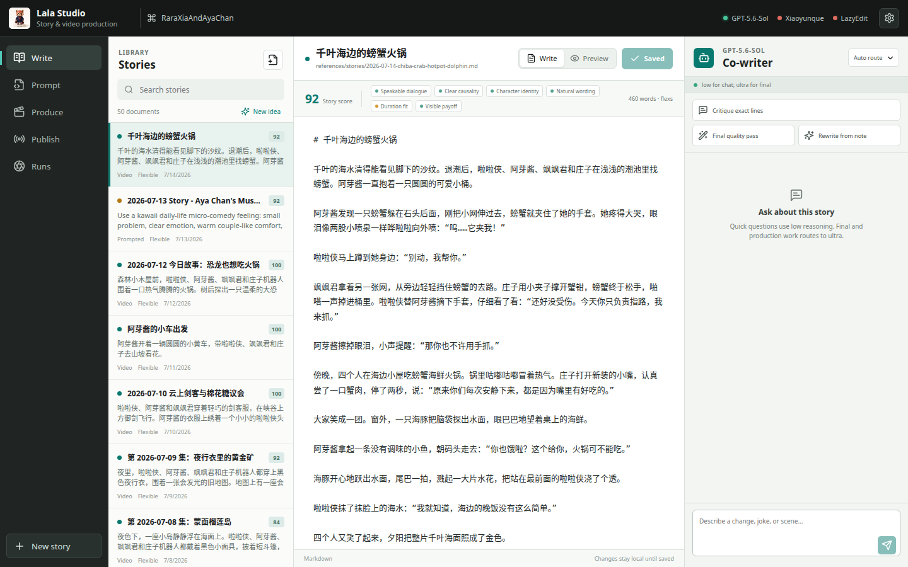

[English](../README.md) · [العربية](README.ar.md) · [Español](README.es.md) · [Français](README.fr.md) · [日本語](README.ja.md) · [한국어](README.ko.md) · [Tiếng Việt](README.vi.md) · [中文 (简体)](README.zh-Hans.md) · [中文（繁體）](README.zh-Hant.md) · [Deutsch](README.de.md) · [Русский](README.ru.md)

[](https://lazying.art)

# Lala Studio

*غرفة إنتاج محلية وهادئة لتحويل قصص الشخصيات إلى فيديو ووسائط جاهزة للنشر.*

[](https://lazying.art) [](https://openai.com/codex/) [](https://github.com/sponsors/lachlanchen)

يجمع Lala Studio بين تحرير القصص بصيغة Markdown، ونقد اللغة الطبيعية، وبناء المطالبات بثبات، وإنتاج الفيديو عبر متصفح Xiaoyunque، ومراقبة المهام، والنشر بواسطة LazyEdit. يعمل محلياً، ويحافظ على موافقة المستخدم قبل أي إجراء مدفوع، ولا يضع المسارات الخاصة أو بيانات الاعتماد داخل المستودع.

| تبرع | PayPal | Stripe |
| --- | --- | --- |
| [](https://chat.lazying.art/donate) | [](https://paypal.me/RongzhouChen) | [](https://buy.stripe.com/aFadR8gIaflgfQV6T4fw400) |

## معاينة



## الوظائف الرئيسية

- محرر قصص مع فحوص للحوار والسببية وثبات الشخصيات وسلاسة اللغة والمدة والنهاية البصرية.
- توجيه `gpt-5.6-sol` ديناميكياً: `low` للمحادثة، و`high` للمسودة، و`xhigh` للنقد، و`ultra` للنسخة النهائية والإنتاج.
- مطالبات Xiaoyunque بلا مسارات محلية، مع ترقيم دقيق للمراجع وبطاقات كلمات متعددة اللغات.
- تجهيز صفحة التوليد بلا إنفاق، وطلب تأكيد صريح قبل إرسال عملية مدفوعة واحدة.
- تجهيز النشر عبر LazyEdit مع سياق القصة والترجمة المتعددة والشعار وقوائم المنصات.

## البدء السريع

```bash
git clone https://github.com/lachlanchen/LalaStudio.git
cd LalaStudio
npm install
cp .env.example .env
npm run dev
```

عيّن `LALA_STUDIO_PROJECT_ROOT` في `.env` إلى مشروع الوسائط، ثم افتح `http://127.0.0.1:4311`.

## الاستخدام كوحدة فرعية

```bash
git submodule add https://github.com/lachlanchen/LalaStudio.git studio
git submodule update --init --recursive
cd studio && npm install && npm run dev
```

إذا كان المجلد الأب يحتوي `references/` و`scripts/` فسيتم اكتشافه تلقائياً.

## التحقق

```bash
npm test
npm run build
npm run test:e2e
```

## الاستشهاد

إذا استخدمت Lala Studio في البحث أو أدوات الإنتاج، فاستشهد بهذا المستودع. يقرأ GitHub ملف [CITATION.cff](../CITATION.cff) ويعرض لوحة الاستشهاد.

```bibtex
@software{chen_lalastudio_2026,
  author = {Chen, Lachlan},
  title = {Lala Studio: A Local Story-to-Video Production Workspace},
  year = {2026},
  url = {https://github.com/lachlanchen/LalaStudio}
}
```

## الحالة

المحرر وواجهة CLI وموجّه النماذج ونظام المهام وعقود إنتاج المتصفح ومحوّل النشر جاهزة. خدمات التوليد والنشر الخارجية تكاملات محلية اختيارية وقد تتطلب تسجيل الدخول.
